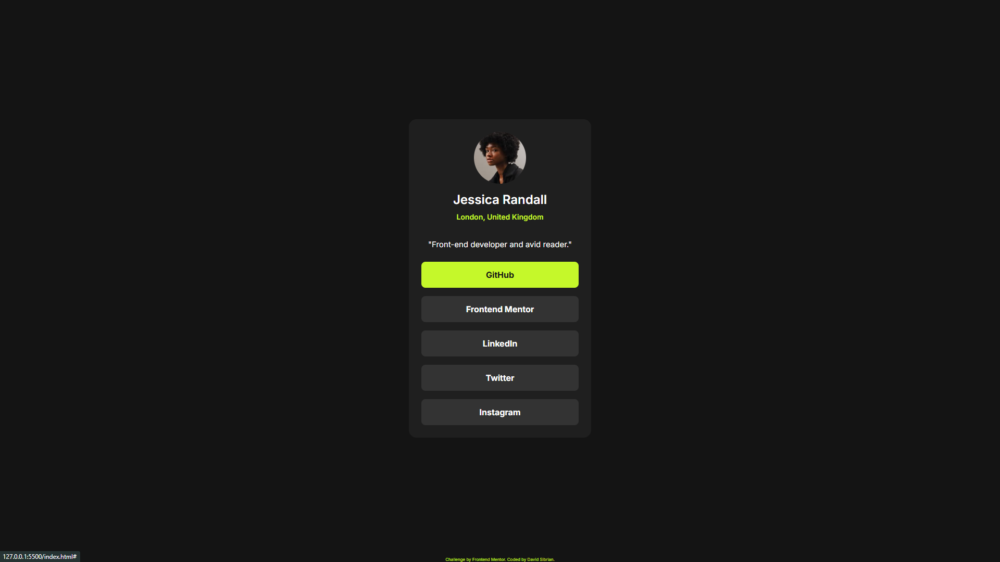

# Frontend Mentor - Social links profile solution

This is a solution to the [Social links profile challenge on Frontend Mentor](https://www.frontendmentor.io/challenges/social-links-profile-UG32l9m6dQ). Frontend Mentor challenges help you improve your coding skills by building realistic projects. 

## Table of contents

- [The challenge](#the-challenge)
- [Screenshot](#screenshot)
- [Links](#links)
- [Built with](#built-with)
- [What I learned](#what-i-learned)
- [Continued development](#continued-development)
- [Useful resources](#useful-resources)
- [Author](#author)

### The challenge

Users should be able to:

- See hover and focus states for all interactive elements on the page

### Screenshot

### Built with

- Semantic HTML5 markup
- CSS custom properties
- CSS Grid
- Mobile-first workflow

### What I learned

I learn a little bit of BEM, I tried to put some better names according to the BEM good practices and I learned to use the `:focus-visible` pseudo-class due to it was a challenge [requirement](#the-challenge).

### Continued development

I want to learn more about pseudo-classes, bem good pratices and to improve the way I structure the code.

### Useful resources

- [BEM better understanding](https://en.bem.info/methodology/quick-start/) - This helped to learn more about the principles of BEM and to clarify questions. I like the way they explain it.

## Author

- Frontend Mentor - [@armson45](https://www.frontendmentor.io/profile/armson45)